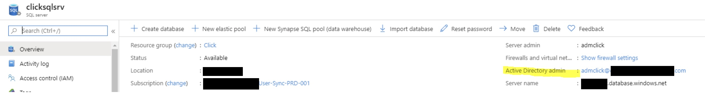

# App-SQL-IdentityProvision

Provision users using a mechanism which will keep the users updated and in sync with the main HR DB. The users will be provisioned as cloud identities and updated regularly with this custom mechanism. 

## Syncronization process

*	Authentication is based on Azure managed identity (passwordless).
*	User creation/update and mail notifications are based on Microsoft Graph.
*	SQL is Azure SQL.
*	Users created or updated will be stamped “ClickSync” in the state attribute.
*	Logs are written to Sync_Log table.


## Azure Configuration
1. Configure VM with AAD identity

2. Assign permissions to Microsoft Graph to manage users

```powershell
$vmObjectId = "<redacted-vm-id>"
Connect-AzureAD
$graph = Get-AzureADServicePrincipal -Filter "AppId eq '00000003-0000-0000-c000-000000000000'"
$userReadWriteAllPermission = $graph.AppRoles `
    | where Value -Like "User.ReadWrite.All" `
    | Select-Object -First 1

$msi = Get-AzureADServicePrincipal -ObjectId $vmObjectId

New-AzureADServiceAppRoleAssignment -Id $userReadWriteAllPermission.Id -ObjectId $msi.ObjectId -PrincipalId $msi.ObjectId -ResourceId $graph.ObjectId  

```

3. Assign permissions to Microsoft Graph to send emails

```powershell
$vmObjectId = "<redacted-vm-id>"
Connect-AzureAD
$graph = Get-AzureADServicePrincipal -Filter "AppId eq '00000003-0000-0000-c000-000000000000'"
$mailSend = $graph.AppRoles `
    | where Value -Like "Mail.Send" `
    | Select-Object -First 1

$msi = Get-AzureADServicePrincipal -ObjectId $vmObjectId

New-AzureADServiceAppRoleAssignment -Id $mailSend.Id -ObjectId $msi.ObjectId -PrincipalId $msi.ObjectId -ResourceId $graph.ObjectId 

```

4. Assign permissions to Microsoft Graph to manage group membership

```powershell
$vmObjectId = "<redacted-vm-id>"
$graph = Get-AzureADServicePrincipal -Filter "AppId eq '00000003-0000-0000-c000-000000000000'"
$permissions = @("GroupMember.ReadWrite.All", "Group.ReadWrite.All", "Directory.ReadWrite.All")
$msi = Get-AzureADServicePrincipal -ObjectId $vmObjectId
foreach($permission in $permissions){
    $aPermission = $graph.AppRoles | where Value -Like $permission | Select-Object -First 1
    New-AzureADServiceAppRoleAssignment -Id $aPermission.Id -ObjectId $msi.ObjectId -PrincipalId $msi.ObjectId -ResourceId $graph.ObjectId 
} 

```

5. Configure AAD admin in the SQL server 



6. Connect to the SQL server using the AAD admin and give permissions to the VM

```sql
CREATE USER clicksrv FROM EXTERNAL PROVIDER
ALTER ROLE db_datareader ADD MEMBER clicksrv
ALTER ROLE db_datawriter ADD MEMBER clicksrv

```

## Application Configuration

### Configuration filename: *ClickSync.runtimeconfig.json*

- `userPrincipalNameSuffix (string)` The suffix of the userPrincipalName to use when creating users, this suffix must be a verified domain in the tenant.

- `sqldb_connection (string)` SQL connection string (example: "Data Source=xx.database.windows.net; Initial Catalog=yy;")

- `rowsPerCycle (integer)` How many rows to read at once (effects memory consumption)

- `sendMailNotification (boolean)` Whether to send mail notifications.

- `mailNotificationTo (string)` Email address to send the notifications to.

- `mailNotificationFrom (string)` Email to send the notifications from, must be member of the tenant and give permissions to the MSI to send emails. (Mail.Send)

- `Debug (boolean)` Get more verbose logging in the console.

- `disableUsers (Boolean)` Whether to disable users that isActive column in Pratim_pp table is set to false.

- `maxRetirements (int)` The maximum users to remove out of groups when RetirementDate is today or before today and ClickSynced is 0, if the number of rows in the database exceeds this value an error will be issued and the users will not be removed from groups in AAD.

- `*licenseGroups (string)` comma separated string of AAD group object id’s, retired users will be removed from those groups (make sure there are no spaces in the string).

### The application requires log table in the same database:
```sql
SET ANSI_NULLS ON
GO

SET QUOTED_IDENTIFIER ON
GO

CREATE TABLE [dbo].[Sync_log](
	[id] [int] IDENTITY(1,1) NOT NULL,
	[date] [datetime] NOT NULL,
	[type] [nvarchar](15) NOT NULL,
	[description] [nvarchar](max) NOT NULL,
 CONSTRAINT [PK_Sync_log] PRIMARY KEY CLUSTERED 
(
	[id] ASC
) WITH (STATISTICS_NORECOMPUTE = OFF, IGNORE_DUP_KEY = OFF) ON [PRIMARY]
) ON [PRIMARY] TEXTIMAGE_ON [PRIMARY]
GO

```
## Troubleshooting

To get the roles the application gets from Microsoft Graph run ClickSync.exe *printRoles*.
You should see the following roles:

*User.ReadWrite.All*

*Directory.ReadWrite.All*

*Group.ReadWrite.All*

*GroupMember.ReadWrite.All*

*Mail.Send*


## Test results

Performance testing to provide some benchmark results:
* 1000 user updates – about 2 min
* 500 users removed from 2 groups – about 170 seconds

