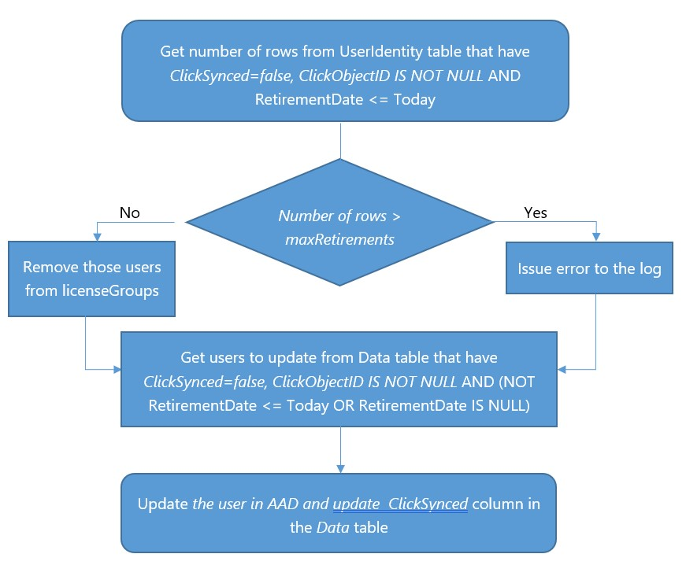
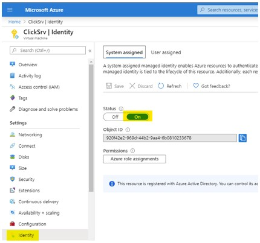

# App-SQL-IdentityProvision

Keep cloud users updated and in sync with the main HR DB. The users are matched by userPrincipalName (the TZ column plus a configurable suffix) and updated regularly with this custom mechanism.

## Synchronization process


*	Authentication is based on Azure managed identity (passwordless).
*	User updates and mail notifications are based on Microsoft Graph.
*	SQL is Azure SQL.
*	Users updated will be stamped “ClickSync” in the state attribute.
*	Users whose RetirementDate has passed are removed from the configured license groups, and disabled when disableUsers is true.
*	Logs are written to Sync_Log table.


## Azure Configuration
1. Configure VM with AAD identity



2. Assign the Microsoft Graph app roles to the VM identity (requires the Microsoft Graph PowerShell SDK, also available in GiveMicrosoftGraphPermissions.ps1)

```powershell
$vmObjectId = "<your-vm-managed-identity-object-id>"

Connect-MgGraph -Scopes "AppRoleAssignment.ReadWrite.All","Application.Read.All"
$graph = Get-MgServicePrincipal -Filter "AppId eq '00000003-0000-0000-c000-000000000000'"
$permissions = @("User.ReadWrite.All", "User.EnableDisableAccount.All", "GroupMember.ReadWrite.All", "Directory.Read.All", "Mail.Send")

foreach($permission in $permissions){
    $role = $graph.AppRoles | Where-Object Value -eq $permission
    New-MgServicePrincipalAppRoleAssignment -ServicePrincipalId $vmObjectId -PrincipalId $vmObjectId -ResourceId $graph.Id -AppRoleId $role.Id
}

```

3. Configure AAD admin in the SQL server 


4. Connect to the SQL server using the AAD admin and give permissions to the VM, the user name must match the VM name (also available in GivePermissions.sql)

```sql
CREATE USER clicksrv FROM EXTERNAL PROVIDER
ALTER ROLE db_datareader ADD MEMBER clicksrv
ALTER ROLE db_datawriter ADD MEMBER clicksrv

```

## Application Configuration

### Configuration filename: *ClickSync.runtimeconfig.json*

The values are set in SyncApp/runtimeconfig.template.json before building (the build generates ClickSync.runtimeconfig.json from it). The keys are case sensitive, and an environment variable with the same name overrides the value from the file.

- `userPrincipalNameSuffix (string)` Required. The suffix added to the TZ column to build the userPrincipalName of the user to update, this suffix must be a verified domain in the tenant.

- `sqldb_connection (string)` Required. SQL connection string (example: "Data Source=xx.database.windows.net; Initial Catalog=yy;")

- `rowsPerCycle (integer)` How many rows to read at once (affects memory consumption). Default 100.

- `sendMailNotification (boolean)` Whether to send mail notifications. Default false.

- `mailNotificationTo (string)` Email address to send the notifications to. Required when sendMailNotification is true.

- `mailNotificationFrom (string)` Email to send the notifications from, must be member of the tenant and give permissions to the MSI to send emails. (Mail.Send) Required when sendMailNotification is true.

- `debug (boolean)` Get more verbose logging in the console.

- `disableUsers (boolean)` Whether to sync the isActive column in the Pratim_pp table to the accountEnabled attribute (users with isActive false are disabled, users with isActive true are enabled again). When true, retired users are also disabled when the retirement is processed (turning this on later will not disable retirements that were already processed).

- `maxRetirements (integer)` The maximum number of pending retirements allowed. If the count of rows with RetirementDate today or earlier that were not processed yet is equal to or greater than this value, an error is issued and no users are removed from groups. Default 500.

- `maxChanges (integer)` The maximum number of pending user changes allowed. If the count is equal to or greater than this value, an error is issued and no users are updated. Default 500.

- `maxSyncRetries (integer)` How many runs a failing user update is retried before the row is skipped (see the SyncErrorCount column below). Retirements are not skipped, they are retried on every run until they succeed. Default 3.

- `licenseGroups (string)` Required. Comma separated string of AAD group object id's, retired users will be removed from those groups.

### The application reads the users from a Pratim_pp table in the same database:
```sql
SET ANSI_NULLS ON
GO

SET QUOTED_IDENTIFIER ON
GO

CREATE TABLE [dbo].[Pratim_pp](
	[TZ] [nvarchar](50) NOT NULL,
	[FirstName] [nvarchar](100) NULL,
	[LastName] [nvarchar](100) NULL,
	[MobilePhone] [nvarchar](50) NULL,
	[ClickObjectID] [nvarchar](50) NULL,
	[RetirementDate] [datetime] NULL,
	[isActive] [bit] NULL,
	[ClickSynced] [bit] NOT NULL DEFAULT 0,
	[SyncErrorCount] [int] NOT NULL DEFAULT 0,
	[RetirementProcessed] [bit] NOT NULL DEFAULT 0,
	[RowVer] [rowversion] NOT NULL,
 CONSTRAINT [PK_Pratim_pp] PRIMARY KEY CLUSTERED 
(
	[TZ] ASC
) WITH (STATISTICS_NORECOMPUTE = OFF, IGNORE_DUP_KEY = OFF) ON [PRIMARY]
) ON [PRIMARY]
GO

```

- `TZ` The employee id, used with userPrincipalNameSuffix to build the userPrincipalName.
- `ClickObjectID` The AAD object id of the user, rows without it are skipped.
- `ClickSynced` Set to 1 by the application after a successful update. The HR feed should set it back to 0 (together with SyncErrorCount) when a row changes.
- `RetirementDate` When the date has passed the user is removed from the license groups (and disabled when disableUsers is true) instead of being updated.
- `RetirementProcessed` Set to 1 by the application after the retirement was handled, and back to 0 when the user is updated again. The HR feed should also set it back to 0 when it changes RetirementDate (a rehired user that retires again).
- `SyncErrorCount` Incremented when handling a row fails. User updates are skipped after maxSyncRetries failures (a warning with the skipped count is logged and mailed), retirements keep being retried every run. Reset to 0 on success, reset it manually to retry a skipped row.
- `RowVer` Used to detect rows the HR feed changed while a sync was running, so the change is not lost.

For an existing HR table only the sync columns need to be added. Mark all the past retirements as processed, otherwise they will all be picked up again (and disabled) on the first run:

```sql
ALTER TABLE [dbo].[Pratim_pp] ADD [SyncErrorCount] [int] NOT NULL DEFAULT 0, [RetirementProcessed] [bit] NOT NULL DEFAULT 0, [RowVer] [rowversion] NOT NULL
GO
UPDATE [dbo].[Pratim_pp] SET RetirementProcessed=1 WHERE RetirementDate <= GETDATE()
GO

```

### The application requires a log table in the same database:
```sql
SET ANSI_NULLS ON
GO

SET QUOTED_IDENTIFIER ON
GO

CREATE TABLE [dbo].[Sync_log](
	[id] [int] IDENTITY(1,1) NOT NULL,
	[date] [datetime] NOT NULL,
	[type] [nvarchar](15) NOT NULL,
	[description] [nvarchar](max) NOT NULL,
 CONSTRAINT [PK_Sync_log] PRIMARY KEY CLUSTERED 
(
	[id] ASC
) WITH (STATISTICS_NORECOMPUTE = OFF, IGNORE_DUP_KEY = OFF) ON [PRIMARY]
) ON [PRIMARY] TEXTIMAGE_ON [PRIMARY]
GO

```

## Build and deploy

The application targets .NET 10. To build, edit SyncApp/runtimeconfig.template.json with your values and run:

```
dotnet publish SyncApp/ClickSync.csproj -c Release
```

Copy the publish output to the VM configured with the managed identity and schedule ClickSync.exe with Task Scheduler at the desired interval. Each run processes the pending rows once and exits (exit code 0 when clean, 1 when there were errors).

## Troubleshooting

To get the roles the application gets from Microsoft Graph run ClickSync.exe *printRoles*.
You should see the following roles:

*User.ReadWrite.All*

*User.EnableDisableAccount.All*

*GroupMember.ReadWrite.All*

*Directory.Read.All*

*Mail.Send*


## Test results

Performance testing to provide some benchmark results:
* 1000 user updates – about 2 min
* 500 users removed from 2 groups – about 170 seconds

## License

MIT, see the LICENSE file.
